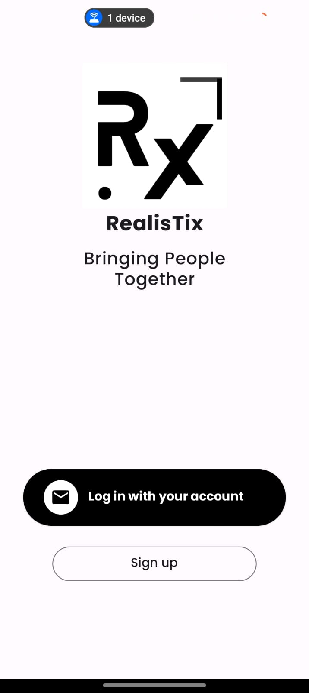
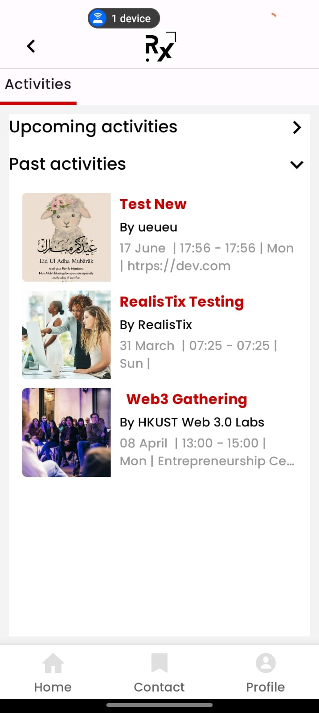
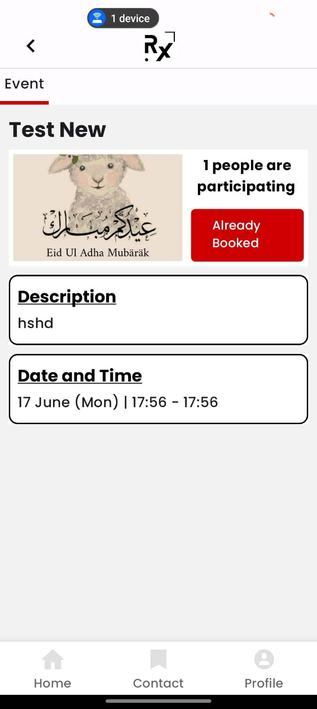
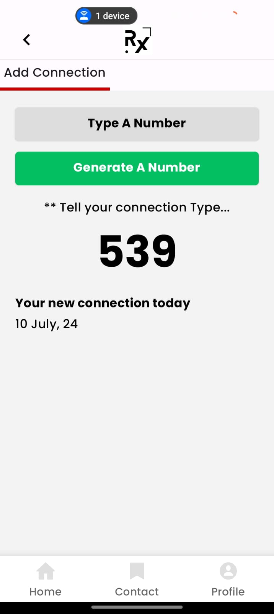
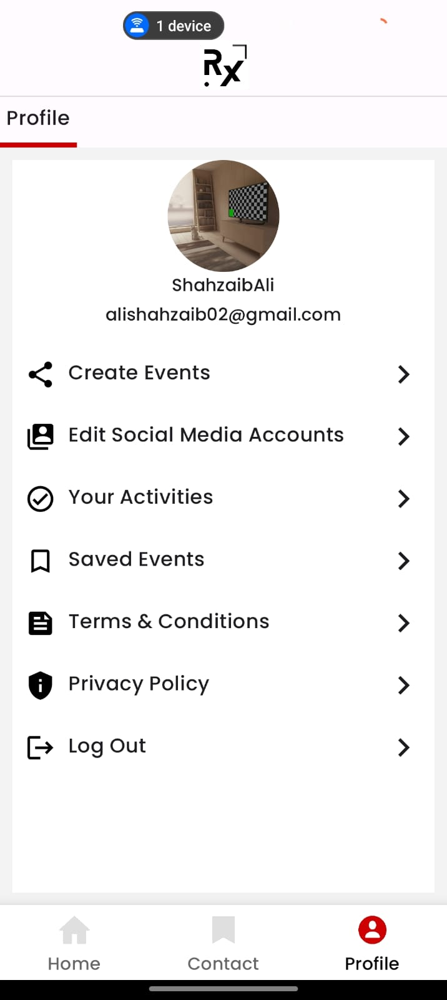

# RealisTix

A comprehensive Android application built using Kotlin and Jetpack Compose. The project follows MVVM architecture, utilizes Koin for dependency injection, and integrates Firebase for backend services, adhering to best practices in modern Android development.

## Table of Contents

- [Features](#features)
- [Screenshots](#features)
- [Architecture](#architecture)
- [Tech Stack](#tech-stack)
- [Installation](#installation)
- [Usage](#usage)
- [Firebase Configuration](#firebase-configuration)
- [Contributing](#contributing)
- [License](#license)

## Features

- Modern UI built with Jetpack Compose
- MVVM architecture for clear separation of concerns
- Dependency injection with Koin
- Firebase integration for backend services
- Pagination for smooth user experience
- Follows best practices in Android development

## Screenshots









## Architecture

This project follows the MVVM (Model-View-ViewModel) architecture pattern:

- **Model:** Represents the data layer, consisting of entities and repository.
- **View:** Displays data and captures user interactions.
- **ViewModel:** Acts as a bridge between the View and Model, handling UI-related data.

## Tech Stack

- **Language:** Kotlin
- **UI:** Jetpack Compose
- **Architecture:** MVVM
- **Dependency Injection:** Koin
- **Backend:** Firebase (Firestore, Authentication, Storage, etc.)
- **Pagination:** Ensures smooth user experience

## Installation

1. **Clone the repository:**
   ```bash
   git clone https://github.com/ShahzaibAli02/RealisTix.git
   cd RealisTix
   ```

2. **Open the project in Android Studio:**
    - Open Android Studio.
    - Select `File > Open...` and choose the project directory.

3. **Sync the project with Gradle files:**
    - Click on `File > Sync Project with Gradle Files`.

4. **Run the project:**
    - Connect your Android device or start an emulator.
    - Click on `Run > Run 'app'`.

## Usage

1. **View Model:** Place your UI-related logic and live data in the ViewModel.
2. **Repository:** Handle data operations (local or remote) in the Repository.
3. **Koin Modules:** Define your dependency graph in Koin modules.
4. **Compose UI:** Build your UI using Jetpack Compose components.

## Firebase Configuration

To configure Firebase for your project:

1. **Go to the Firebase Console:** https://console.firebase.google.com/
2. **Create a new project** or select an existing one.
3. **Add Android app** to your Firebase project:
    - Register your app with your package name.
    - Download the `google-services.json` file.
    - Place the `google-services.json` file in the `app` directory of your project.
4. **Add Firebase SDK:**
    - Follow the instructions on the Firebase console to add the Firebase SDK to your project.

## Contributing

Contributions are welcome! Please follow these steps to contribute:

1. Fork the repository.
2. Create a new branch (`git checkout -b feature/your-feature-name`).
3. Commit your changes (`git commit -m 'Add some feature'`).
4. Push to the branch (`git push origin feature/your-feature-name`).
5. Open a pull request.

## License

This project is licensed under the MIT License. See the [LICENSE](LICENSE) file for details.
